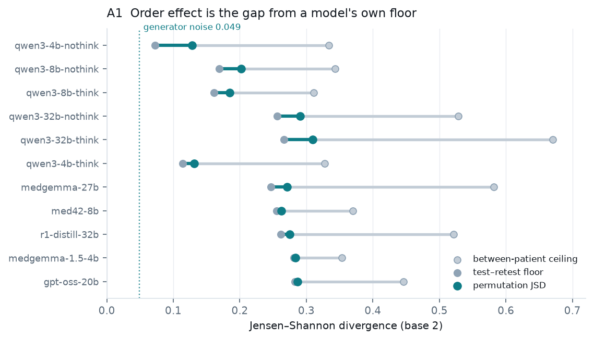
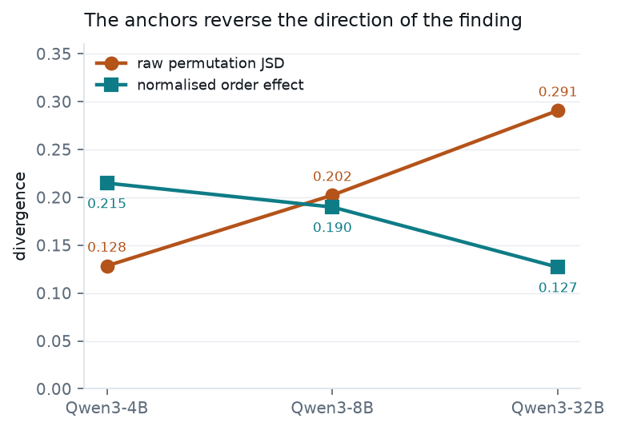
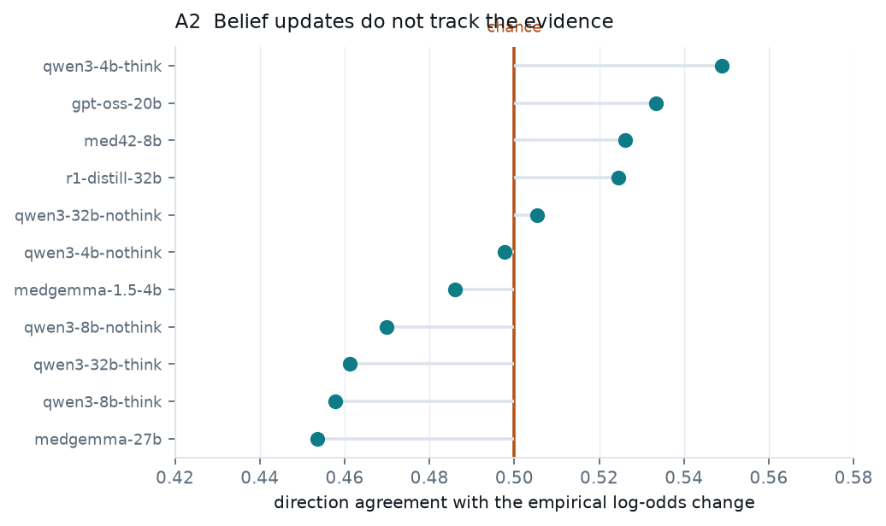
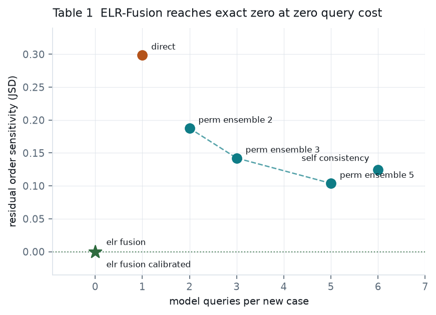
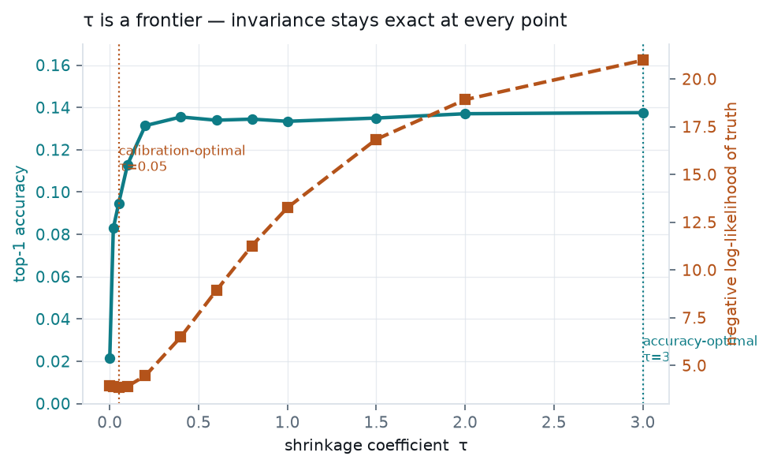
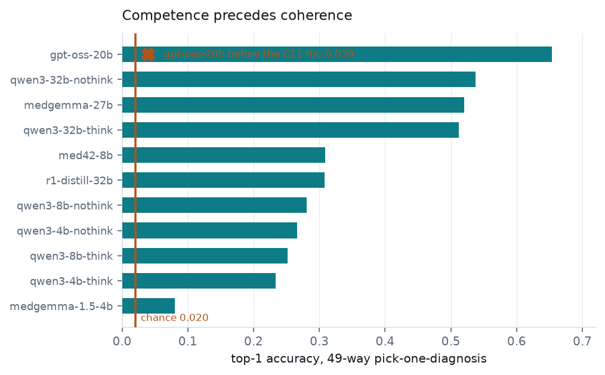

# Probabilistic Coherence as a Test of Clinical Reasoning in Language Models

**CoDx** — the Coherence in Differential diagnosis battery (the instrument)
**ELR-Fusion** — Elicited Likelihood-Ratio fusion (the method)

*Prepared for submission to [Machine Learning and Knowledge Extraction](https://www.mdpi.com/journal/make) (MDPI, MAKE).*

---

## Abstract

Bayesian belief revision is order-invariant as a theorem: `P(d | e₁…eₙ)` is a
function of the evidence **set**, not the sequence in which it arrives. This
gives a correctness criterion for clinical language models that requires no
annotator, no judge model, and no independence assumption — the target value is
known to be zero exactly.

We evaluate eleven open-weight models (4B–32B; general, medically tuned, and
reasoning-distilled) on **1,153,478 elicited responses** over 1,956 DDXPlus
patients and 49 pathologies, with a held-out MIMIC-IV-Note external-validity
arm. Every divergence is reported against **three anchors measured on the same
model** — its test–retest floor, its between-patient ceiling, and a
dataset-level generator noise floor of JSD = 0.0490 that we establish from
exact-replicate cases in DDXPlus itself.

Three findings. First, the anchors **reverse the direction** of the headline
result: raw permutation divergence rises with model scale (0.128 → 0.291 across
the Qwen3 4B/8B/32B ladder) while the normalised order effect falls
(0.215 → 0.127). Second, and more seriously, **belief updates do not track the
evidence at all**: direction agreement with an assumption-free empirical oracle
is 0.454–0.549 across all eleven models, straddling chance, with r² never
exceeding 0.021. Third, **ELR-Fusion** attains an exactly zero order effect —
verified numerically at 5.55 × 10⁻¹⁶ — at zero marginal query cost, where
permutation ensembling decays only as O(1/√K) and still leaves 0.104 at five
queries per case; we report its accuracy cost rather than conceal it.

We release eleven documented instrument-calibration steps as a first-class
artifact. Several would each have produced a plausible but wrong headline —
most sharply **C11**, in which a model scoring 1.000 schema validity and 1.000
informative rate was answering at chance, and whose coherence numbers would
have been the paper's headline finding had accuracy not been checked.

---

## 1. Contributions

**C1. An order-invariance axiom with an exact zero, measured against three
anchors.** Not "models show order effects" — that is known — but *how much of
the observed divergence is attributable to order*, once the model's own
resampling noise and the between-patient scale are both measured on that same
model. We are not aware of prior work in this space that reports a test–retest
floor, and without one the result points the wrong way (§4.1).

**C2. An assumption-free absolute reference for belief updating.** DDXPlus
ships **0 of 888** conditional probability slots. Rather than assume
conditional independence to reconstruct them — which we show fails at
JSD 0.546 against a 0.049 noise floor, 11× — we condition directly on the
1.29M released patients with Wilson intervals and a ≥500-case support minimum.
This makes the A2/A3 axioms *absolute* while making **no** independence
assumption, removing the standard objection to Bayesian clinical baselines from
the measurement itself (§4.2).

**C3. A ground-truth noise floor for DDXPlus.** 25.8% of exact-replicate cases
receive different differentials (mean JSD 0.0490). Every DDXPlus
differential-matching metric therefore has a ceiling below 1.0 — a result that
applies to any work on this corpus, not only ours.

**C4. A remedy whose guarantee is a theorem, not a result.** ELR-Fusion is
exactly order-invariant by construction at any evidence budget, verified at
machine epsilon, against ensembling whose residual decays as O(1/√K) and which
yields no per-finding explanation. We add a shrinkage coefficient τ that
**preserves the guarantee exactly for every τ** and exposes an
accuracy–calibration frontier (§4.5).

**C5. Instrument calibration as a first-class artifact.** Eleven documented
steps, several of which would each have produced a plausible but wrong headline
number (§5).

---

## 2. Data and models

| | |
|---|---|
| Cases | 1,956 DDXPlus patients, 49 pathologies, 223 findings |
| Elicited responses | **1,153,478** (1,119,920 DDXPlus + 33,558 MIMIC) |
| Oracle corpus | 1,292,579 DDXPlus patients |
| External validity | MIMIC-IV-Note discharge summaries (held local) |
| Seed | 20260912 |

Eleven models: Qwen3-4B/8B/32B (thinking and non-thinking), MedGemma-1.5-4B,
MedGemma-27B, Llama3-Med42-8B, DeepSeek-R1-Distill-Qwen-32B, and GPT-OSS-20B.

> **Credentialed data.** MIMIC-IV-Note is PhysioNet credentialed data under a
> use agreement that forbids redistribution. Patient text and per-case results
> never leave the machine; only aggregate divergence statistics are shared. The
> Hub sync hard-refuses any path matching `mimic`, `physionet`,
> `discharge.csv`, or `radiology.csv`, and `.gitignore` excludes
> `results/raw_mimic/` explicitly.

**GPT-OSS-120B was not run.** Its 63 GB of MXFP4 weights exceed the 48 GB card,
and with `cpu_offload_gb=28` every forward pass streams 28 GB over PCIe: 16
hours of generation produced 0 of 20 chunks (< 0.035 items/s against 3.2 for
GPT-OSS-20B). The A1 core alone would need ≈ 13 days. This is reported as a
hardware limit, not a result.

---

## 3. Method

### 3.1 The axioms

| axiom | claim | target |
|---|---|---|
| **A1** order invariance | `P(d \| e₁…eₙ)` depends on the evidence set, not its order | 0 |
| **A2** belief updating | adding a finding moves belief in the direction the corpus says | slope 1 |
| **A3** redundancy | certified-uninformative evidence must not move belief | 0 |
| **A4** positional anchoring | no position in the sequence carries special weight | 0 |

A4 is named *positional anchoring*, not "premature closure", to avoid a
collision with Handler et al. [[4]](#ref4), who use that term for
failure-to-abstain.

### 3.2 ELR-Fusion

Log-odds accumulate over the evidence set, so the result is order-invariant by
construction:

```
log-odds(d | E)  =  log-odds(d)  +  τ · Σᵢ log LR(eᵢ | d)
```

The likelihood-ratio table is elicited **once per finding for the whole
corpus**, so a new case costs **zero** additional model queries. Because the sum
ranges over an unordered set, and scaling an order-invariant quantity leaves it
order-invariant, the guarantee holds for **every** τ — verified across 600
permutations at three τ values, max |Δp| = 5.55 × 10⁻¹⁶.

τ is the log-odds form of temperature scaling [[7]](#ref7), applied to the
evidence term so the prior is untouched. It corrects the naive-Bayes
over-counting that arises because clinical findings are correlated but are
summed as though independent. It is fitted by **cross-fitting** over two folds
of cases, so the coefficient applied to a case is never fitted on that case.

---

## 4. Results

### 4.1 A1 — the anchors reverse the finding



Each model's permutation divergence sits between its own test–retest floor and
its own between-patient ceiling. The order effect is the **gap from the floor**,
not the observed value.

| model | JSD perm | floor | ceiling | **norm. order effect** | top-1 flip |
|---|---|---|---|---|---|
| qwen3-4b-nothink | 0.1284 | 0.0722 | 0.3339 | **0.2149** | 0.796 |
| qwen3-8b-nothink | 0.2023 | 0.1692 | 0.3435 | 0.1898 | 0.947 |
| qwen3-8b-think | 0.1844 | 0.1611 | 0.3111 | 0.1551 | 0.885 |
| qwen3-32b-nothink | 0.2908 | 0.2562 | 0.5286 | 0.1270 | 0.928 |
| qwen3-32b-think | 0.3095 | 0.2666 | 0.6705 | 0.1062 | 0.887 |
| qwen3-4b-think | 0.1315 | 0.1143 | 0.3279 | 0.0805 | 0.699 |
| medgemma-27b | 0.2712 | 0.2464 | 0.5817 | 0.0741 | 0.836 |
| med42-8b | 0.2623 | 0.2550 | 0.3697 | 0.0637 | 0.957 |
| r1-distill-32b | 0.2750 | 0.2616 | 0.5216 | 0.0517 | 0.938 |
| medgemma-1.5-4b | 0.2836 | 0.2815 | 0.3532 | 0.0285 | 0.994 |
| gpt-oss-20b | 0.2866 | 0.2831 | 0.4460 | **0.0211** | 0.959 |



**Raw divergence rises with scale; the normalised effect falls.** The
test–retest floor rises faster than the order effect does, so reporting the raw
number alone inverts the conclusion. This is the strongest argument for the
three-anchor design, and it is why prior order-effect numbers are not directly
comparable to these.

The top-1 flip rate is high everywhere (0.70–0.99): reordering the same findings
changes the leading diagnosis for most patients even where distributional
movement is modest.

**A caution on the bottom of the table.** GPT-OSS-20B's 0.0211 and
MedGemma-1.5-4B's 0.0285 are not coherence successes. Both have floors that have
nearly reached their own ceilings, and flip rates of 0.96 and 0.99. A small
normalised effect is also what you get when the denominator collapses; these
rows must be read alongside §4.4.

### 4.2 A2 — belief updates do not track the evidence



| quantity | range over 11 models |
|---|---|
| slope β | 0.0009 – 0.0576 (ideal: 1.0) |
| r² | ≤ 0.0207 |
| \|Spearman ρ\| | ≤ 0.0606 |
| **direction agreement** | **0.4536 – 0.5489** (chance: 0.5) |

Whether a model's belief in a diagnosis rises or falls when a finding is added
is **uncorrelated** with whether the corpus says it should. Six of eleven models
have a slope interval excluding zero — the effect is real, tiny, and swamped.

This is the strongest negative result in the study. A1 is a consistency failure
and could be argued down as sampling noise. A2 is a failure of **direction**,
against ground truth, with no independence assumption available to attack.

### 4.3 A3 — irrelevant findings move the differential

Evidence the corpus certifies as uninformative moves the posterior by more than
the model's own resampling noise for **15.8%–44.9%** of cases, and flips the
leading diagnosis for **26.5%–69.8%**. Mean spurious JSD ranges 0.0759–0.2687;
p90 reaches 0.93, meaning that for a tenth of cases an irrelevant finding moves
the belief state almost as far as swapping in a different patient. This
reproduces, in the clinical setting and against an absolute reference, the
"irrelevant context" degradation reported for probabilistic forecasts by
Andrews and Sarkar [[1]](#ref1).

### 4.4 A4 — positional anchoring

Position effects are present but small: η² = 0.245–0.269 over 600 cases, with
the position effect between −0.004 and 0.014. **Order matters (A1), but not
primarily through a simple first- or last-position anchor** — the effect is
distributed rather than positional. This distinguishes the clinical
belief-revision setting from the multiple-choice option-order effects
documented by Schilcher et al. [[5]](#ref5) and Lin et al. [[6]](#ref6).

### 4.5 Table 1 — remedies



Paired over the cases every method produced, for `qwen3-32b-nothink`:

| method | order residual | queries/case | top-1 | top-5 | entropy | exact? | audit |
|---|---|---|---|---|---|---|---|
| direct | 0.2988 | 1 | **0.1892** | 0.3006 | 3.94 | no | no |
| self-consistency | 0.1244 | 6 | 0.2265 | 0.4346 | 4.50 | no | no |
| perm-ensemble K=2 | 0.1876 | 2 | 0.2117 | 0.3686 | 4.27 | approx | no |
| perm-ensemble K=3 | 0.1422 | 3 | 0.2265 | 0.4131 | 4.41 | approx | no |
| perm-ensemble K=5 | 0.1038 | 5 | **0.2377** | **0.4443** | 4.53 | approx | no |
| **ELR-Fusion (τ=1)** | **0.0000** | **0** | 0.1334 | 0.2480 | 0.86 | **exact** | **yes** |
| **ELR-Fusion (calibrated)** | **0.0000** | **0** | 0.0997 | 0.2393 | 5.25 | **exact** | **yes** |

ELR-Fusion is the only method reaching an exactly zero order effect, at zero
marginal query cost. Permutation ensembling buys its residual with queries and
decays only as O(1/√K): five queries per case still leaves 0.1038, and no K
reaches zero.

**The honest cost is accuracy.** ELR-Fusion trades 5.6 top-1 points against
direct elicitation (0.189 → 0.133) and 10.4 against a five-query ensemble. The
guarantee is not free, and reporting it as free would be the easy dishonesty
here.

### 4.6 The shrinkage coefficient is a frontier, not a fitted constant



| τ | top-1 | top-5 | NLL of truth | entropy |
|---|---|---|---|---|
| 0.00 | 0.0215 | 0.1125 | 3.947 | 5.47 |
| 0.05 | 0.0946 | 0.2367 | **3.858** | 5.31 |
| 0.10 | 0.1130 | 0.2469 | 3.907 | 4.89 |
| 0.20 | 0.1314 | 0.2495 | 4.457 | 3.73 |
| **0.40** | **0.1355** | 0.2444 | 6.491 | 2.22 |
| 1.00 | 0.1334 | 0.2480 | 13.261 | 0.86 |
| 3.00 | 0.1375 | 0.2515 | 20.977 | 0.26 |

Accuracy peaks near τ ≈ 0.4; the likelihood of the truth peaks near τ ≈ 0.05 —
an eightfold-different operating point. The unshrunk default τ = 1 is near
accuracy-optimal and among the **worst-calibrated** points on the grid
(NLL 13.3 against 3.86 achievable). Order-invariance is exact at every point.

We report the sweep in full rather than collapse it to a fitted number, because
a single τ would conceal that the two objectives disagree. Since τ = 0 (prior
only) scores 0.0215, the elicited weights carry real signal — but an NLL-optimal
use of them sits close to ignoring them. **Improving the log-LR elicitation, not
the fusion rule, is where the remaining accuracy is.**

---

## 5. Instrument calibration



Eleven calibration steps are documented in
[`reports/instrument_calibration.md`](reports/instrument_calibration.md).
Several would each have produced a plausible but wrong headline: arm-dependent
schema failures (C4), a 62.9% uniform collapse behind "100% schema validity"
(C6), an inverted shuffled ceiling and canonical-order contamination of the
floor (C7), and two defects in Table 1 itself (C9).

### C11 — schema validity is not evidence that the model answered

Every gate before this one constrains the **shape** of a response. None checks
whether the numbers track the patient.

Under grammar-constrained decoding, GPT-OSS-20B returned `{"index": 0}` for
essentially every case — at **1.000 schema validity** and **1.000 informative
rate** — scoring 0.0394 against a 0.0204 chance rate. Its coherence numbers
looked like a finding (permutation JSD 0.683 against a between-patient ceiling
of 0.689, top-1 flip rate 1.000) and would have been reported as catastrophic
incoherence.

The cause is the harmony response format: the rendered prompt ends at
`<|start|>assistant` and the template requires a channel on every message, so
the first token must be `<|channel|>` — which a JSON grammar forbids. The model
is pushed off its training distribution and emits the shortest schema-satisfying
string. (vLLM's `openai_gptoss` reasoning parser does not help: its
`is_reasoning_end()` returns `True` unconditionally, as it exists for the
serving path rather than offline generation.)

Decoded freely, with the text after the `assistantfinal` marker parsed:

| GPT-OSS-20B, same 34,885 items | top-1 |
|---|---|
| grammar applied from token 0 | 0.0394 |
| free decode + final-channel parse | **0.6532** |

A **16.6× change from one decoding flag**, making it the most accurate model in
the sweep (competence ratio 32.0×). Deliberately **no pass/fail accuracy
threshold** is imposed: a weak model (MedGemma-1.5-4B, 3.9× chance, top-class
share 0.467) and a broken one (2.1× chance, 0.459) are not separable by any
single cut. What settled it was a within-model comparison — change one thing
about one model, re-measure the same items.

---

## 6. Reproducing

```bash
source scripts/env.sh          # HF_HOME redirect, Blackwell sm_120 flags
bash scripts/run_all.sh        # sweep → sync → LoRA → analysis → sync
.venv/bin/python -m coherence.analysis.run_analysis
.venv/bin/python -m coherence.analysis.figures_results
```

Every stage is resumable at task granularity; rerunning skips completed work.
Tables land in `reports/tables/`, figures in `reports/figures/`.

| path | contents |
|---|---|
| [`coherence/axioms/`](coherence/axioms/) | A1–A4 estimators |
| [`coherence/data/empirical_oracle.py`](coherence/data/empirical_oracle.py) | assumption-free posterior oracle |
| [`coherence/methods/elr_fusion.py`](coherence/methods/elr_fusion.py) | ELR-Fusion, τ shrinkage, invariance proof |
| [`coherence/analysis/competence.py`](coherence/analysis/competence.py) | the C11 competence gate |
| [`reports/data_audit_report.md`](reports/data_audit_report.md) | 19 audit findings |
| [`reports/instrument_calibration.md`](reports/instrument_calibration.md) | C1–C11 |
| [`reports/paper/`](reports/paper/) | related work, methodology, results |

---

## References

<a id="ref1"></a>[1] Andrews, I. and Sarkar, S. (2026). *Dutch Books for
Language Models*. arXiv:2609.02797. <https://arxiv.org/abs/2609.02797>

<a id="ref2"></a>[2] Fansi Tchango, A., Goel, R., Wen, Z., Martel, J. and
Ghosn, J. (2022). *DDXPlus: A New Dataset for Automatic Medical Diagnosis*.
Advances in Neural Information Processing Systems 35, Datasets and Benchmarks
Track. arXiv:2205.09148. <https://arxiv.org/abs/2205.09148>

<a id="ref3"></a>[3] Chen, W., Zhu, Z., Huang, G. and Wang, W. (2026).
*MedEinst: Benchmarking the Einstellung Effect in Medical LLMs through
Counterfactual Differential Diagnosis*. arXiv:2601.06636.
<https://arxiv.org/abs/2601.06636>

<a id="ref4"></a>[4] Handler, R., Bedi, S. and Shah, N. (2026). *Quantifying
and Mitigating Premature Closure in Frontier LLMs*. arXiv:2605.15000.
<https://arxiv.org/abs/2605.15000>

<a id="ref5"></a>[5] Schilcher, P., Karasin, D., Schöpf, M., Saleh, H.,
Tommasel, A. and Schedl, M. (2025). *Characterizing Positional Bias in Large
Language Models: A Multi-Model Evaluation of Prompt Order Effects*. Findings of
the Association for Computational Linguistics: EMNLP 2025.
<https://aclanthology.org/2025.findings-emnlp.1124/>

<a id="ref6"></a>[6] Lin, Y.-X., Li, C.-A., Wei, S.-L., Chen, P.-C., Chen,
H.-H. and Lee, H.-y. (2025). *Hearing the Order: Investigating Position Bias in
Large Audio-Language Models*. arXiv:2510.00628.
<https://arxiv.org/abs/2510.00628>

<a id="ref7"></a>[7] Guo, C., Pleiss, G., Sun, Y. and Weinberger, K. Q. (2017).
*On Calibration of Modern Neural Networks*. Proceedings of the 34th
International Conference on Machine Learning, PMLR 70.
<https://proceedings.mlr.press/v70/guo17a.html>

<a id="ref8"></a>[8] McDuff, D., Schaekermann, M., Tu, T., Palepu, A., Wang,
A., Garrison, J., Singhal, K. et al. (2023). *Towards Accurate Differential
Diagnosis with Large Language Models*. arXiv:2312.00164.
<https://arxiv.org/abs/2312.00164>

<a id="ref9"></a>[9] Johnson, A., Pollard, T., Horng, S., Celi, L. A. and
Mark, R. (2023). *MIMIC-IV-Note: Deidentified free-text clinical notes*
(version 2.2). PhysioNet.
<https://physionet.org/content/mimic-iv-note/2.2/>

*All references above were verified against their primary sources (arXiv,
ACL Anthology, PMLR, NeurIPS Proceedings, PhysioNet) during preparation.*
